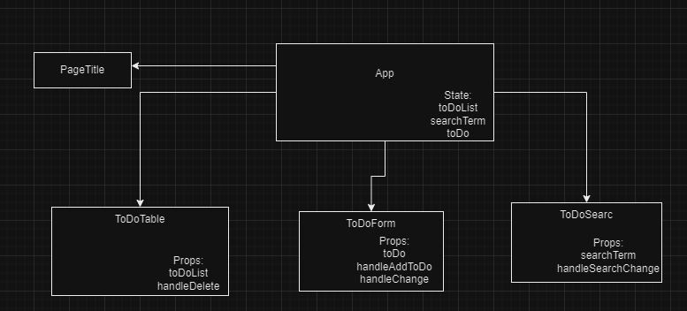

# Component analise :
### Photo of the component:

### Description:
- ToDoForm has side effect on all components through the function handleAddToDo. handleAddToDo adds a new toDo object 
to the toDoList, which causes all components in the application container to re-render
- ToDoTable has side effect on all components through the function handleDeleteToDo. handleDeleteToDo deletes
a toDo object in the toDoList, which causes all components in the application container to re-render 
- ToDoSearch has side effect on all components through the function handleSearch. handleSearch filters the toDoList 

The previously mentioned methods have a side effect on the PageTitle component
and this is a bad practice that needs to be fixed 