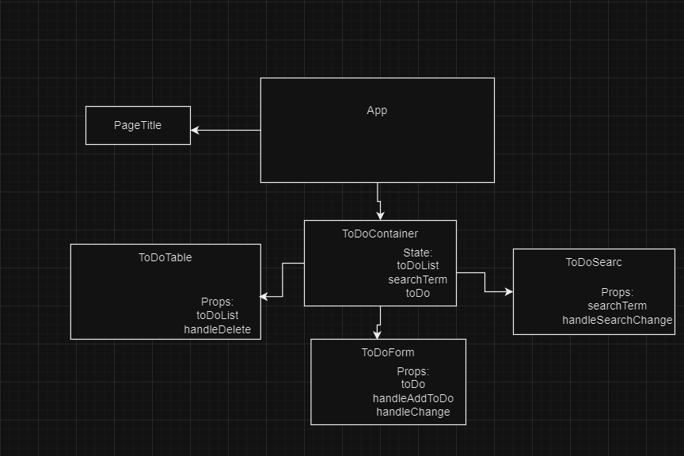

# Component analise:
### Photo of the component:

### Description:
- ToDoForm has side effect on all components in ToDoContainer component through the function handleAddToDo. handleAddToDo adds a new toDo object
  to the toDoList, which causes all components in the ToDoContainer container to re-render
- ToDoTable has side effect on all components through the function handleDeleteToDo. handleDeleteToDo deletes
  a toDo object in the toDoList, which causes all components in the ToDoContainer container to re-render
- ToDoSearch has side effect on all components in ToDoContainer through the function handleSearch. * * **handleSearch set value from input to searchTerm state in useToDo hook** * *

In this lab, the problem with side effects on the PageTitle component was fixed by using the toDoContainer.
